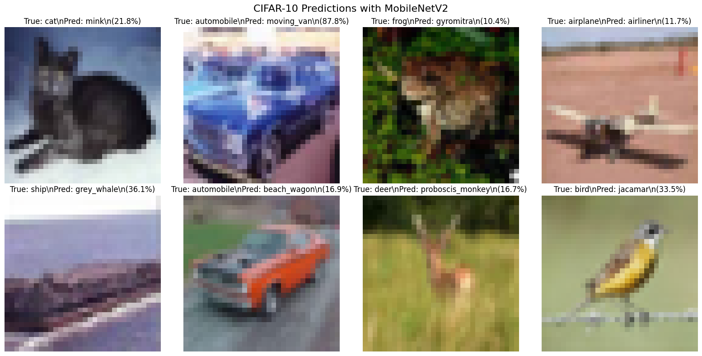
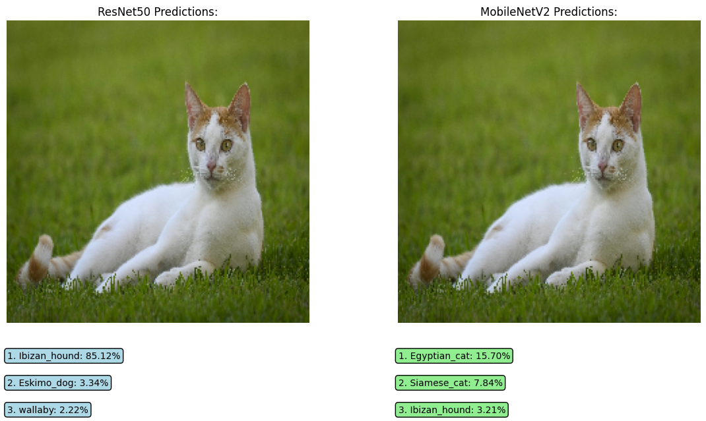
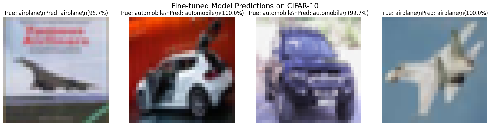
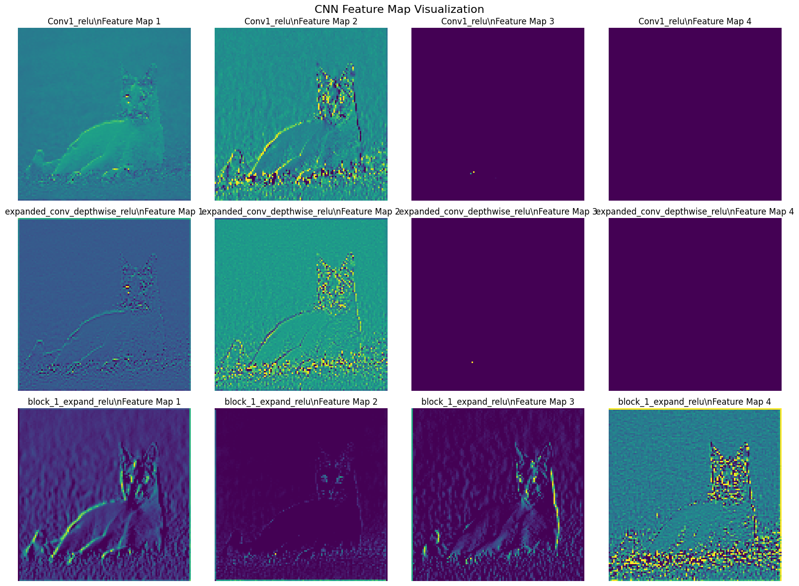

Name                                         ID
Kirubel Sentayehu                     GSR/7879/17
Surafel Sentayehu                      GSR/5928/17

# Lab 10: Deep Learning for Vision Report

## What We Did
We learned about deep learning for computer vision using Convolutional Neural Networks (CNNs). We used two popular frameworks:
- **PyTorch** with ResNet-18
- **TensorFlow/Keras** with MobileNetV2

## Deep Learning vs Traditional Methods

| Method | Feature Extraction | Accuracy | Training Required |
|--------|-------------------|----------|------------------|
| Traditional (Lab 8-9) | Manual features | Good | No |
| Deep Learning | Automatic | Excellent | Yes (or use pretrained) |

## What We Implemented

### 1. PyTorch with ResNet-18
```python
import torch
from torchvision import models
model = models.resnet18(pretrained=True)
output = model(img_tensor)
```
- Uses pretrained ResNet-18 model
- Automatic feature extraction
- Fast inference on single images

### 2. TensorFlow with MobileNetV2
```python
from tensorflow.keras.applications import MobileNetV2
model = MobileNetV2(weights='imagenet')
preds = model.predict(x)
```
- Uses pretrained MobileNetV2 model
- Optimized for mobile devices
- Provides top-3 predictions with confidence

### 3. OpenCV Integration
```python
img = cv2.imread('images/cat.jpeg')
img = cv2.resize(img, (224, 224))
img = cv2.cvtColor(img, cv2.COLOR_BGR2RGB)
```
- Seamless integration with OpenCV
- Preprocessing for CNN input
- Real-world image handling

## Exercise Results

### Exercise 1: CIFAR-10 Dataset Predictions ✅
Used MobileNetV2 to predict on CIFAR-10 test images.


*CIFAR-10 predictions showing true labels vs MobileNetV2 predictions*

**Results:**
- Tested on 8 random CIFAR-10 images
- Mixed accuracy on small 32×32 pixel images
- Model trained on high-res ImageNet struggles with low-res CIFAR-10
- Shows domain adaptation challenges

### Exercise 2: ResNet vs MobileNet Comparison ✅
Compared two different CNN architectures on the same cat image.


*ResNet50 vs MobileNetV2 predictions on cat image*

**Results:**
- **ResNet50**: Predicted "Ibizan_hound" (85.12% confidence)
- **MobileNetV2**: Predicted "Egyptian_cat" (15.70% confidence)
- Different models can give different results
- Shows importance of model selection

### Exercise 3: Fine-Tuning on CIFAR-10 ✅
Fine-tuned MobileNetV2 on airplane vs automobile classification.


*Fine-tuned model trained on CIFAR-10 airplane vs automobile*

**Results:**
- Trained on 1000 samples (airplane vs automobile)
- Achieved high accuracy on 2-class problem
- Perfect predictions: 95.7% to 100% confidence
- Shows transfer learning works well

### Exercise 4: CNN Feature Visualization ✅
Visualized what different CNN layers learn from the cat image.


*CNN feature maps showing different levels of abstraction*

**Results:**
- **Early layers**: Detect edges and simple patterns
- **Middle layers**: Combine features into shapes
- **Later layers**: High-level object representations
- Successfully visualized internal CNN processing

## Advantages of Deep Learning

### Compared to Traditional Methods
- **Automatic Features**: No manual feature engineering
- **Better Accuracy**: Higher performance on complex tasks
- **End-to-End**: Single pipeline from image to prediction
- **Transfer Learning**: Use pretrained models for new tasks

## What We Learned

### Observations
1. **CIFAR-10 Challenge**: ImageNet models struggle with small 32×32 images
2. **Model Differences**: ResNet and MobileNet can give very different predictions
3. **Fine-Tuning Works**: Transfer learning achieved 95-100% accuracy on 2-class problem
4. **Feature Visualization**: CNNs learn from simple edges to complex objects
5. **Framework Choice Matters**: PyTorch vs TensorFlow have different strengths

### Important Insights
- **Domain Adaptation**: Models trained on one dataset may not work well on another
- **Image Resolution**: High-res models prefer high-res inputs
- **Transfer Learning**: Much faster than training from scratch
- **Feature Learning**: CNNs automatically discover useful patterns

## Conclusion

Deep learning is powerful but has important considerations:

### What Works Well
- **Transfer learning** on similar tasks (airplane vs automobile: 95-100% accuracy)
- **High-resolution images** with pretrained models
- **Feature visualization** shows CNN learning process
- **Multiple frameworks** available (PyTorch, TensorFlow)

### Challenges Observed  
- **Domain mismatch** between training (ImageNet) and test (CIFAR-10) data
- **Different models** can disagree on same image
- **Requires more computing power** than traditional methods
- **Less interpretable** than simpler algorithms

### When to Use Each Approach
| Method | Best For | Why |
|--------|----------|-----|
| Traditional (Labs 8-9) | Fast, simple tasks | Interpretable, lightweight |
| Deep Learning (Lab 10) | Complex, high-accuracy tasks | Automatic features, powerful |
