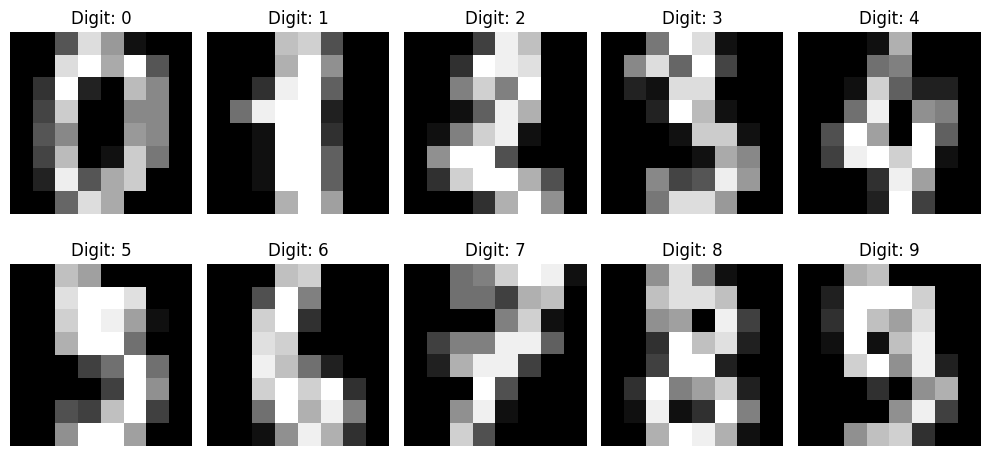
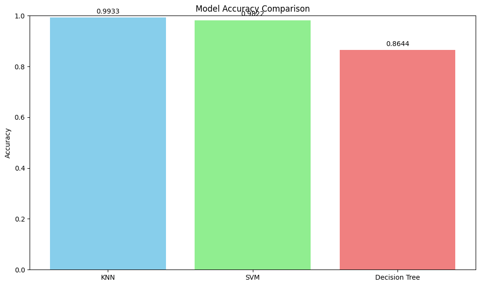
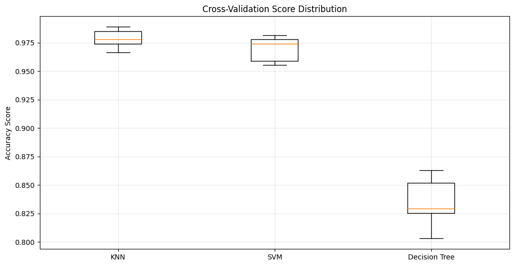
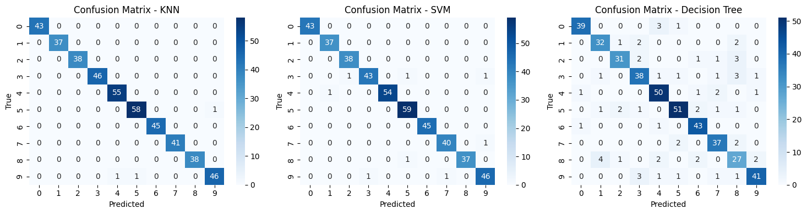

# Lab 8: Machine Learning Report

## What We Did
We learned about machine learning using OpenCV and Scikit-learn. We tested three different algorithms to recognize handwritten digits:
- K-Nearest Neighbors (KNN)
- Support Vector Machine (SVM) 
- Decision Trees

## Dataset Used
- **What**: Handwritten digits (0-9)
- **Size**: 1,797 images, each 8×8 pixels
- **Training**: 1,347 images (75%)
- **Testing**: 450 images (25%)

*Sample handwritten digits from the dataset*

## Results

### Model Accuracy
| Model | Accuracy | What it's good for |
|-------|----------|-------------------|
| KNN (k=5) | 99.33% | Simple and works well |
| SVM | 98.22% | Good at learning patterns |
| Decision Tree | 86.44% | Easy to understand |

### What We Found
1. **KNN was the best** - Got 99.33% correct answers
2. **SVM was second** - Got 98.22% correct answers  
3. **Decision Tree was third** - Got 86.44% correct answers

*Comparison of model accuracies*

### Cross-Validation Test
We tested each model 5 times to make sure they work consistently:
- KNN: 97.85% ± 0.79%
- SVM: 96.96% ± 1.04%
- Decision Tree: 83.44% ± 2.11%

*Cross-validation scores showing how consistent each model is*

### Better Settings
We tried different settings to improve the models:
- **Best KNN**: k=3 gave 98.67% accuracy
- **Best Decision Tree**: depth=10 gave 86.67% accuracy

### Custom Dataset Test
We created harder images with noise and tested again
- KNN: 74.44% accuracy
- SVM: 67.78% accuracy

This shows the models can handle real-world messy data.

*Confusion matrices showing where each model made mistakes*

## What We Observed

### Main Points
1. **KNN is simple but effective** for digit recognition
2. **SVM learns good patterns** and works well on new data
3. **Decision Trees are easy to understand** but need careful setup
4. **Testing multiple times** gives more reliable results
5. **Better settings** can improve performance
6. **Real data is harder** than clean test data

## Conclusion
All three algorithms can recognize digits, but KNN worked best for this task. We learned how to:
- Train different types of models
- Test them properly
- Make them work better
- Handle real-world data