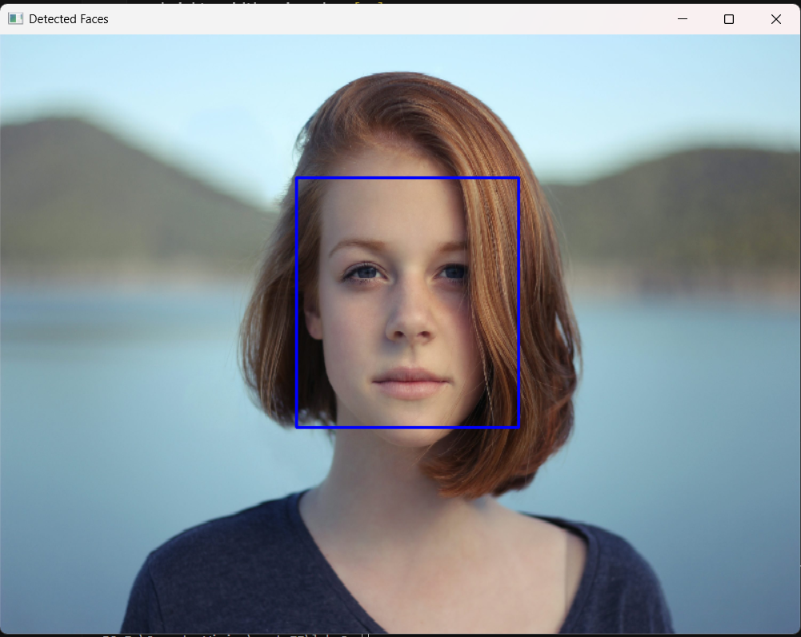
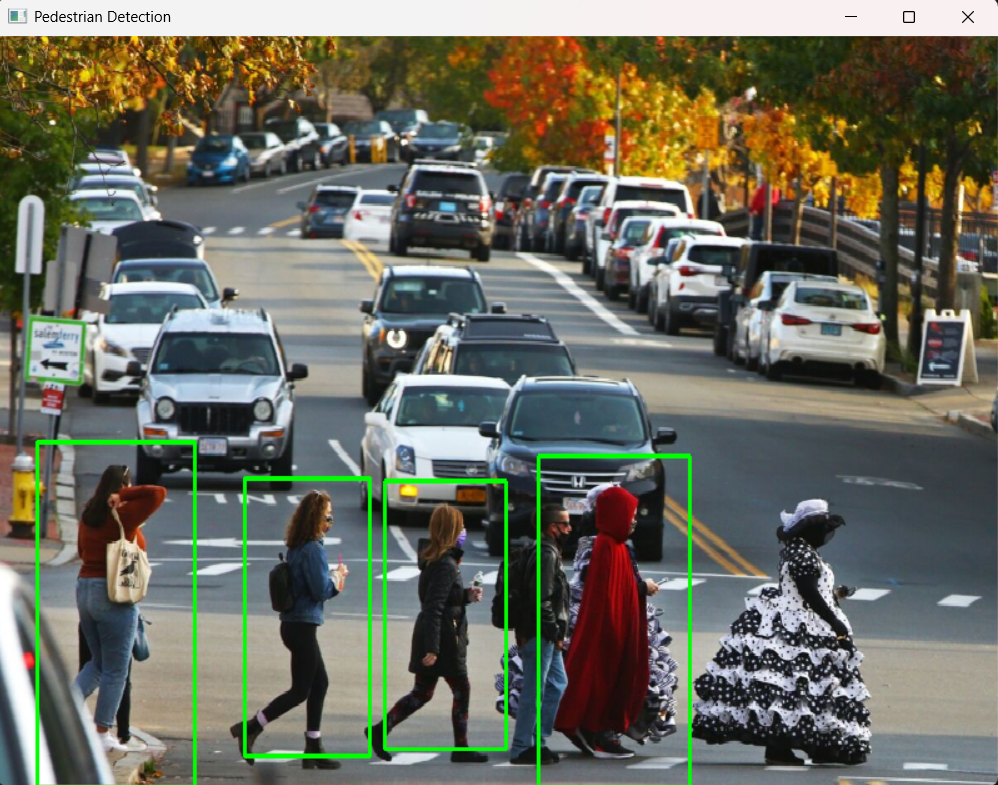
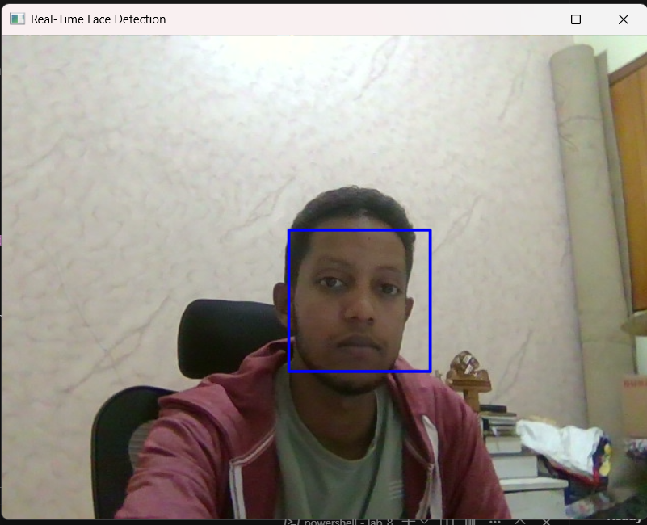
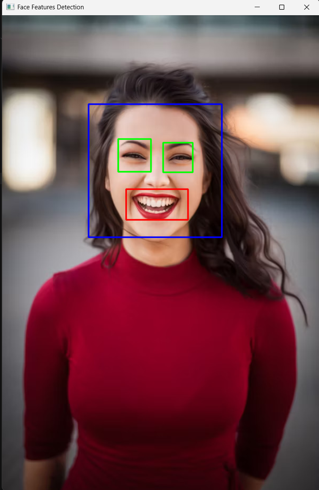
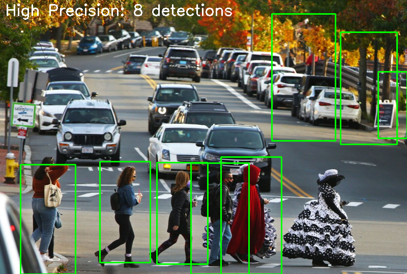
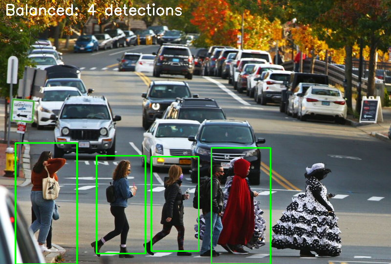
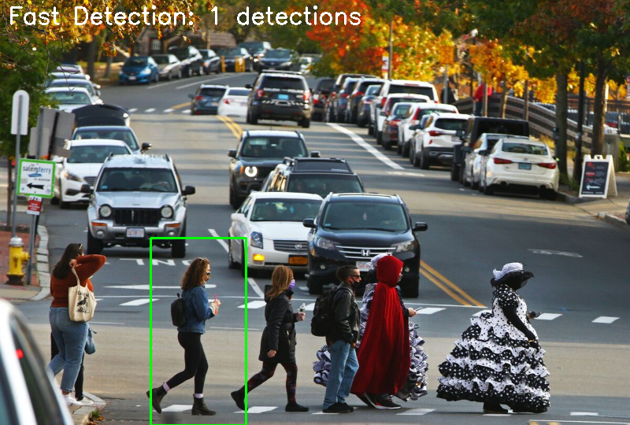
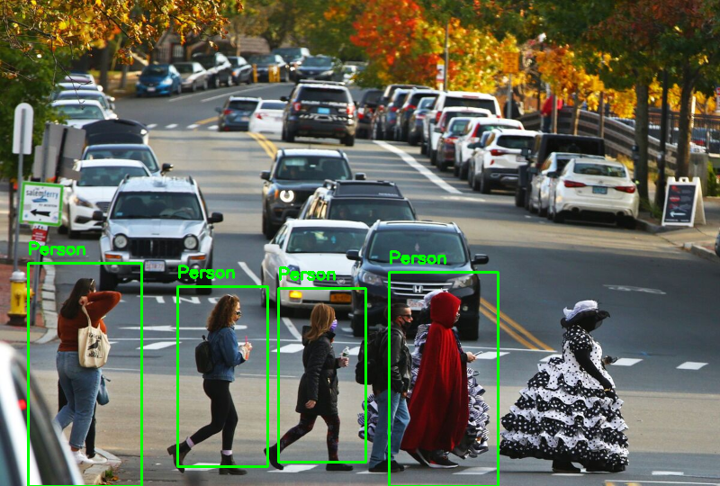

# Lab 9: Object Detection Report

## What We Did
We learned about object detection using OpenCV. We implemented two main methods:
- **Haar Cascades** for face detection
- **HOG + SVM** for pedestrian detection

## Detection Methods

| Method | Speed | Best For | How It Works |
|--------|-------|----------|--------------|
| Haar Cascades | Fast | Faces | Uses pre-trained patterns |
| HOG + SVM | Medium | People | Analyzes edge patterns |

## What We Implemented

### 1. Face Detection
```python
face_cascade = cv2.CascadeClassifier('haarcascade_frontalface_default.xml')
img = cv2.imread('face_sample.jpeg')
faces = face_cascade.detectMultiScale(gray, scaleFactor=1.1, minNeighbors=5)
```
- Draws blue rectangles around faces
- Uses pre-trained Haar cascade


*Haar cascade successfully detected the face in our test image*

### 2. Pedestrian Detection
```python
hog = cv2.HOGDescriptor()
hog.setSVMDetector(cv2.HOGDescriptor_getDefaultPeopleDetector())
(rects, weights) = hog.detectMultiScale(img, winStride=(8,8), scale=1.05)
```
- Draws green rectangles around people
- Uses HOG features with SVM classifier


*HOG + SVM successfully detected multiple pedestrians in the street scene*

### 3. Real-Time Detection
```python
cap = cv2.VideoCapture(0)
while True:
    ret, frame = cap.read()
    faces = face_cascade.detectMultiScale(gray, 1.1, 4)
```
- Live webcam processing
- Real-time face detection
- Press 'q' to quit


*Real-time face detection working on live webcam feed*

## Exercise Results

### Exercise 1: Eye and Smile Detection ✅
Used `face_smile.jpg` to detect faces, eyes, and smiles simultaneously.


*Successfully detected face (blue), eyes (green), and smile (red) in the same image*

### Exercise 2: Video Processing with Save ✅
Processed `people.mp4` frame-by-frame and saved results as `people_detected.mp4`.


*Frame-by-frame pedestrian detection with statistics overlay*

**Statistics:**
- Total frames: 596
- Total detections: 139 people
- Average: 0.23 people per frame

### Exercise 3: HOG Parameter Tuning ✅
Tested three different parameter settings to compare speed vs accuracy:

**High Precision (winStride=4, scale=1.02):**

*8 detections - Most accurate but slower*

**Balanced (winStride=8, scale=1.05):**

*4 detections - Good balance of speed and accuracy*

**Fast Detection (winStride=16, scale=1.1):**

*1 detection - Fastest but less sensitive*

### Exercise 4: Combined Detection Pipeline ✅
Used both Haar cascades and HOG+SVM together on the same image.


*Combined pipeline: Blue boxes = Faces, Green boxes = Pedestrians*

**Results:** 0 faces, 4 pedestrians detected in street scene

## Detection Results Analysis

Based on our test images, we can see:

### Face Detection Performance
- **Successfully detected face** in the portrait image
- **Accurate bounding box** around the person's face
- **Works well** with good lighting and frontal view
- **Fast processing** suitable for real-time applications

### Pedestrian Detection Performance  
- **Detected multiple people** in the street crossing scene
- **Green bounding boxes** around each pedestrian
- **Handles different poses** and clothing styles
- **Works in complex scenes** with background objects

### Real-Time Performance
- **Live webcam detection** working smoothly
- **Real-time processing** without lag
- **Immediate face detection** as person appears
- **Stable tracking** during movement

## Key Differences

### Haar Cascades
- ✅ Very fast
- ✅ Good for faces  
- ✅ Works in real-time
- ❌ Sensitive to lighting
- ❌ Sensitive to angle

### HOG + SVM
- ✅ More robust
- ✅ Good for pedestrians
- ✅ Handles variations better
- ✅ Works in complex scenes
- ❌ Slower than Haar


## Conclusion
Both methods work well for different purposes:
- Use **Haar Cascades** for fast face detection
- Use **HOG + SVM** for robust people detection
- Both run in real-time on regular computers
- Without deep learning or special hardware needed
